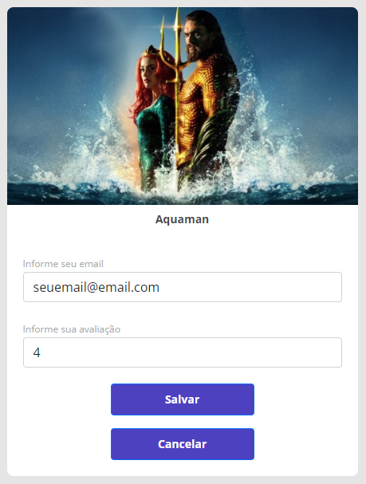

# Movie Rating - Projeto Spring React

## Link da Aplicação

https://jordan-movierating.netlify.app/

Obs: o servidor fica em stand by quando não é utilizado por mais de 30 minutos, levará cerca de 40 segundos para carregar a aplicação.

## Layout web

  

  

### Configuração do Projeto

#### Ferramentas Utilizadas
- VSCode
- Spring Tool Suite
- Postgres / PgAdmin
- Postman

#### Dependências do Spring
- Web
- JPA
- H2
- Postgres
- Security

#### Gerenciador de dependências
- Maven

#### Hospedagem
- Netlifly
- Heroku

### Passos para a instalação na sua máquina
<b>1 - Clonar o repositório</b>

git clone git@github.com:Jordanrafael92/Movie-Rating.git

<b>2 - Na pasta Frontend, fazer as seguintes instalações:</b>
	
- Instalar o yarn: npm install --global yarn 

	
- Instalar o react (depois copia os aquivos do front para esta pasta): yarn create react-app frontend --template typescript

	
- Adiciona o bootstrap: yarn add bootstrap@5.1.3

	
- Adiciona a biblioteca do React Router DOM: yarn add react-router-dom@6.2.1 @types/react-router-dom@5.3.2

<b>3 - Subir o backend</b>

<b>4 - Rodar o frontend e verificar se a aplicação esta comunicando com o backend</b>
	
- No diretório frontend, executar o seguinte comando: yarn start

<b>5 - A aplicação iniciará automaticamente no navegador, no endereço:</b>

http://localhost:3000/

## Developer
Jordan Silva

https://www.linkedin.com/in/jordan-silva/

